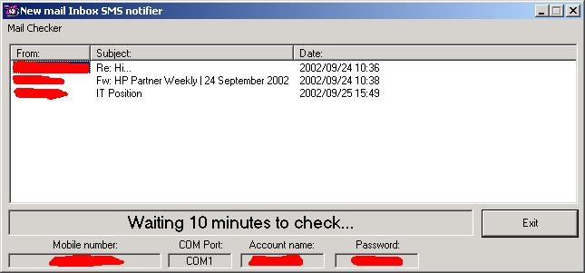



## Outlook Express New Mail 2 SMS

### Description

This program checks for new Messages in Outlook Express and, when one or more are received, it sends an SMS message to the specified mobile phone.
 
### More Info
 
See the readme.txt. It uses MAILCHEK.INI

You must install the MobileFBUS.OCX and the LongTimer OCX to allow this program to work.

MobileFBUS.OCX is included because I have no idea where I got it from. It works well with Nokia mobile phones and associated data cables. I don't know if it would work with other brands. "Long Timer" is also included because of the requirement of the program to wait from 10, 20, 30,etc minutes, based on the amount specified in the INI file. 60 seconds is not long enough.

             |
---                |---
**Submitted On**   |2002-09-21 15:24:28
**By**             |[Mark Borchers](https://github.com/Planet-Source-Code/PSCIndex/blob/master/ByAuthor/mark-borchers.md)
**Level**          |Intermediate
**User Rating**    |4.0 (8 globes from 2 users)
**Compatibility**  |VB 6\.0
**Category**       |[Internet/ HTML](https://github.com/Planet-Source-Code/PSCIndex/blob/master/ByCategory/internet-html__1-34.md)
**World**          |[Visual Basic](https://github.com/Planet-Source-Code/PSCIndex/blob/master/ByWorld/visual-basic.md)
**Archive File**   |[Outlook\_Ex1358319252002\.zip](https://github.com/Planet-Source-Code/mark-borchers-outlook-express-new-mail-2-sms__1-39243/archive/master.zip)

